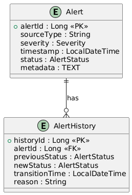
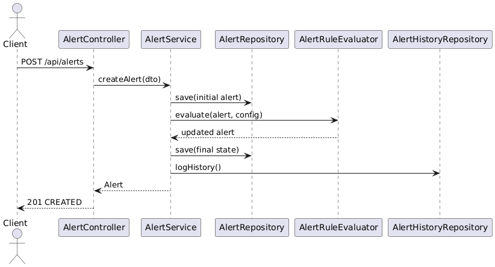
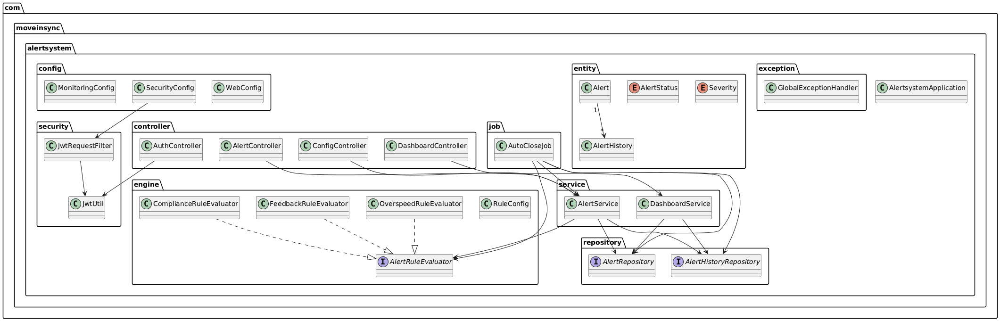

# 🚨 Alert Escalation & Resolution System


---

## 📌 Overview

The **Alert Escalation & Resolution System** is a production-style full-stack alert management platform engineered to automate incident handling, enforce SLA compliance, and provide real-time operational visibility.

The system demonstrates:

- Secure JWT-based authentication
- Automated rule-driven escalation engine
- Clean layered backend architecture
- Transaction-safe alert lifecycle management
- Full-stack integration (React + Spring Boot)
- UML-driven system design documentation

This project reflects real-world enterprise backend engineering principles used in incident management and monitoring systems.

---

# 🏗️ Architecture Overview

## High-Level System Flow

```
Client (React Frontend)
        ↓
REST API (Spring Boot)
        ↓
Controller Layer
        ↓
Service Layer (Business Logic + Escalation Engine)
        ↓
Repository Layer (JPA/Hibernate)
        ↓
MySQL Database
```

### Architectural Principles

- Layered Architecture (Controller → Service → Repository)
- Separation of Concerns
- Stateless Authentication (JWT)
- Transactional Data Integrity
- Global Exception Handling
- Clean Code & Maintainability

---

# 🔐 Security Architecture

The system uses **JWT-based stateless authentication**.

### Authentication Flow

1. User registers
2. Password stored using BCrypt hashing
3. User logs in
4. JWT token generated
5. Token sent in `Authorization: Bearer <token>`
6. Backend validates token for each request

Security Highlights:

- No session storage
- Password hashing using BCrypt
- Secured endpoints
- Token validation filter
- Frontend protected routes

---

# 🔄 Alert Lifecycle & Escalation Engine

## Alert States

- `OPEN`
- `ESCALATED`
- `RESOLVED`

## Processing Pipeline

1. Alert created
2. Persisted to database
3. Escalation rules evaluated
4. SLA conditions validated
5. Status updated if required
6. Event logged
7. Resolution tracked

### Escalation Engine Capabilities

- Severity-based escalation
- Time-based SLA evaluation
- Duplicate escalation prevention
- Idempotent status transitions
- Event audit logging

---

# 📊 UML System Design

All diagrams are located inside `/docs`.

## Entity Relationship Diagram



Represents:

- Alert entity
- Event logs
- User mapping
- Alert lifecycle structure

---

## Sequence Diagram — Alert Processing



Represents:

- REST request flow
- Rule evaluation
- Escalation logic
- Persistence lifecycle

---

## UML Class Diagram — Domain Model



Represents:

- User interactions
- Alert creation
- Escalation
- Resolution workflow

---

## Architecture Diagram


Represents:
- Layer separation


---

# ⚙️ Core Features

## Alert Management

- Create alerts
- View alerts
- Update status
- Resolve alerts
- Track lifecycle history

## Automated Escalation

- SLA breach detection
- Severity evaluation
- Status auto-transition
- Event generation

## Audit Logging

- Escalation events
- Resolution events
- Full lifecycle traceability

## Exception Handling

- Centralized global handler
- Standardized error responses
- Validation management

## Frontend Dashboard

- Alert listing
- Status filtering
- Secure API communication
- Responsive UI

---

# 🛠️ Technology Stack

## Backend

- Java 21
- Spring Boot
- Spring Security
- JWT Authentication
- JPA / Hibernate
- MySQL
- Maven
- Lombok

## Frontend

- React (Vite)
- Tailwind CSS
- Axios
- React Router

---

# 📂 Repository Structure

```
/Alert-Escalation-Resolution-System
│
├── backend
│   ├── controller
│   ├── service
│   ├── repository
│   ├── entity
│   ├── config
│   ├── exception
│   └── AlertSystemApplication.java
│
├── frontend
│   ├── src
│   ├── package.json
│   └── tailwind.config.js
│
├── docs
│   ├── er-diagram.png
│   ├── sequence-diagram.png
│   ├── class-diagram.png
│   └── usecase-diagram.png
│
└── README.md
```

---

# 🚀 Getting Started

## Prerequisites

- Java 21
- Maven
- Node.js 16+
- MySQL running locally

---

## Clone Repository

```bash
git clone https://github.com/phanipaladugula/Alert-Escalation-Resolution-System-MoveInSync.git
```

---

## Backend Setup

```bash
cd backend
mvn clean install
mvn spring-boot:run
```

Configure `application.properties`:

```
spring.datasource.url=jdbc:mysql://localhost:3306/alertsystem
spring.datasource.username=root
spring.datasource.password=yourpassword
jwt.secret=your_256_bit_secret_key
```

---

## Frontend Setup

```bash
cd frontend
npm install
npm run dev
```

Access:

```
http://localhost:5173
```

---

# 📈 Performance Considerations

- Rule evaluation: O(n)
- Status update: O(1)
- Event logging: O(1)
- Stateless authentication improves scalability
- Clean transaction boundaries ensure data consistency

---

# 🧪 Reliability & Edge Case Handling

- Duplicate escalation prevention
- Escalation loop control
- Transaction rollback safety
- Token validation on every request
- Secure password storage
- Centralized exception mapping

---

# 🔮 Future Enhancements

- Role-Based Access Control (RBAC)
- Email/SMS notification integration
- WebSocket real-time updates
- Redis caching layer
- Microservices architecture
- Cloud-native deployment (Docker + Kubernetes)

---

# 🎯 Engineering Highlights

- Enterprise-style layered architecture
- JWT-secured REST APIs
- Automated escalation engine
- SLA monitoring logic
- UML-driven documentation
- Production-ready configuration
- Full-stack integration

---


# ⭐ Final Outcome

The **Alert Escalation & Resolution System** delivers:

- Secure incident handling
- Automated escalation workflows
- SLA-compliant processing
- Clean backend design
- Audit-compliant lifecycle tracking
- Real-world engineering practices

This project demonstrates scalable, maintainable, and production-oriented system design aligned with modern enterprise alert management platforms.

---
